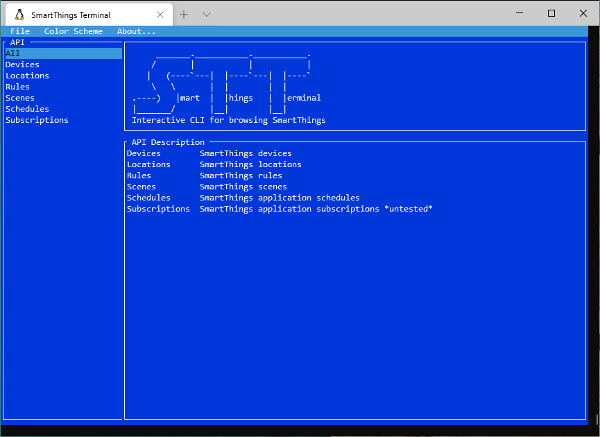
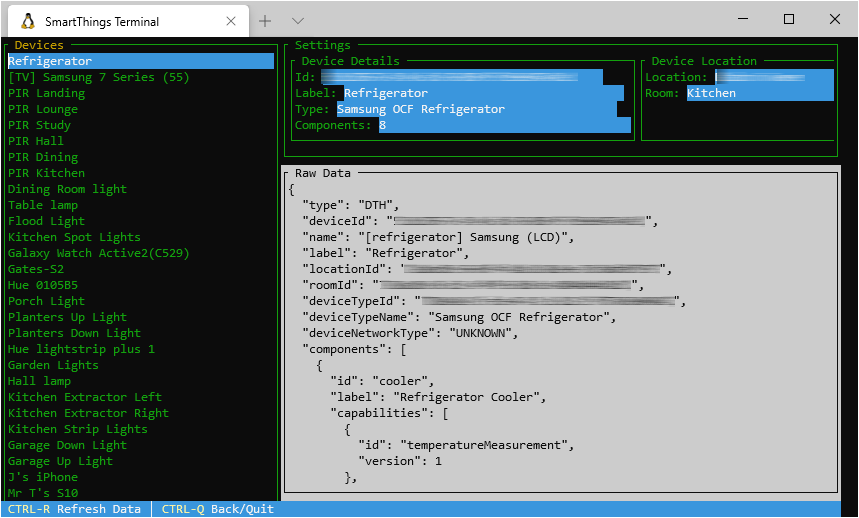
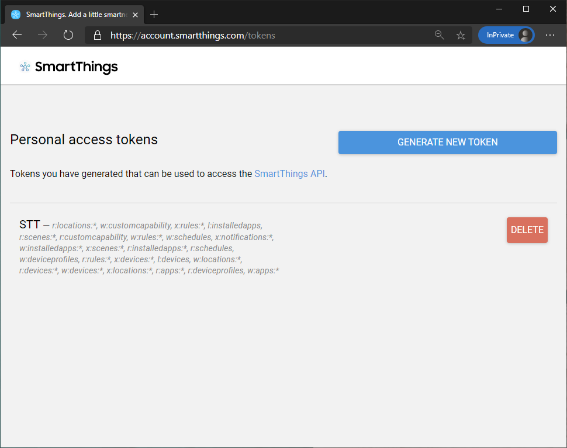

# SmartThings Terminal




# Overview

SmartThings Terminal is a cross platform (.NET 5.0) CLI tool for the SmartThings API, providing a simple GUI terminal for navigating devices and settings within your SmartThings environment.  The functionality of this CLI is driven by the supporting [SmartThingsNet](https://github.com/daltskin/SmartThingsNet) dotnet sdk, which uses the underlying [SmartThings API](https://smartthings.developer.samsung.com/docs/api-ref/st-api.html). This tool is aimed at the SmartThings developer ecosystem and the curious to get quick insight into their smart home environments.

# Features



This CLI tool has the following features:

| Screen | View | Import | Export | Run commands | Edit | Save | Copy | Delete |
| ----- |:-----:|:------:|:------:|:------:|:------:|:------:|:------:|:------:|
| Capabilities | * | n/a | * | n/a | n/a | n/a | n/a | n/a | 
| Devices | * | n/a | * | * | n/a | n/a | n/a | n/a | 
| Locations | * | n/a | * | n/a | n/a | * | * | * | 
| Rooms | * | n/a | * | n/a | n/a | * | * | * | 
| Rules | * | * | * | n/a | n/a | n/a | n/a | n/a |
| Scenes | * | n/a | * | * | n/a | n/a | n/a | n/a |
| Schedules | * | n/a | * | n/a | n/a | * | * | * |
| Installed Apps | * | n/a | * | n/a | n/a | n/a | n/a | n/a |

*Some n/a features are due to the underlying API availability.*

# Hotkeys

Hotkeys are dependant on the selected screen:

* F1 Device component status
* F4 Toggle device switch on/off
* F3 Edit
* F4 Save
* F5 Refresh - refresh data at any point
* F6 Copy
* F7 Delete (use with caution**)
* F12 - Back to menu screen
* CTRL-Q - Quit

# Mouse support

Mouse support for navigating through screens, menu options and copying of information.

# Usage

Either clone the repo, or simply download the latest executable binaries version for your operating system from [releases](https://github.com/daltskin/SmartThingsTerminal/releases)

Simply run from your command prompt providing your access token.  If you don't have an access token, it's easy to set one up here: https://account.smartthings.com/tokens

***WARNING: Whilst there is some validation to stop corrupting your SmartThings environment configuration, you use this tool at your own risk.  Delete commands are unreversable - so ensure you know what you doing.*



## Command line

Using the -t (or --accesstoken) argument, provide your personal access token from the above into the STT  tool eg:

```bash
$ ./STT -t {accesstoken}
```


Alternatively, you can jump straight into a specific screen by providing the screen name using the -s (or --screen) argument using one of the following values:

| devices | installedapps | locations | rules | scenes | schedules | subscriptions |

eg:

```bash
$ ./STT -t {accesstoken} -s devices
```

## Environment variables

You can use an environment variable called `STT_ACCESSTOKEN` and `STT_SCREEN` in place of the command line arguments should you wish to not have to pass them on the command line. The Command Line takes precendence over any environment variables. In order of importance :- 
- `local.env` file in the directory of the executable. VSCode is configured to copy this file to the target directory if you add it to the `SmartThingsTerminal` folder (same level as the csproj)
- system environment variable. This is only used if command line or `.env` file are not present. An example is left commented out in the `launch.json` file.

## Full feature list

* View Capability Summaries
  * View all of the capability summaries
  * View capability details
  * Export capability summary to a json file
* View Devices
  * View all of the registered devices
  * View device components status
  * Toggle lights/switches on/off or Window Shades open/closed
  * Export device to a json file
* Install Applications
  * View details of installed applications
  * Export application to a json file* 
* Locations
  * View the different location details
  * Edit/Update location details
  * Copy locations
  * Delete locations
  * Export location to a json file
* Rooms
  * View the rooms in all locations
  * Edit/update room details
  * Copy rooms
  * Delete rooms
  * Export room to a json file
* Rules
  * View rules
* Scenes
  * View scene details
  * Run scenes
  * Export scene to a json file
* Schedules 
  * View integration schedules
  * Copy schedules (untested)
  * Delete schedules (untested)
  * Export schedule to a json file

# Credits

This uses [Miguel de Icaza's](https://github.com/migueldeicaza) [console-based user inteface toolkit](https://github.com/migueldeicaza/gui.cs).

This also uses the [CommandLineParser](https://github.com/commandlineparser/commandline) project for manipulating command line arguments.